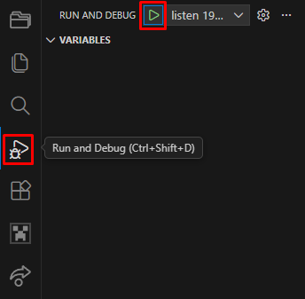

# Contributing to Commander-API

Commander-API への貢献に興味を持っていただき、ありがとうございます！  
このページでは、Commander-API へ貢献する方法について記されています。  
読み進める前に、以下のページを閲覧しておくことをオススメします。  
[OSSに貢献するときの心得](https://zenn.dev/kyome/articles/1259c94ad576ca)

## はじめに

### 環境

開発には以下のプログラムが必要です。

- [Node.js](https://nodejs.org)
- [npm](https://www.npmjs.com/)

### インストール

1. リポジトリをクローンします。

```bash
git clone https://github.com/Unknown-Creators-Team/Commander-API.git
```

2. 依存関係をインストールします。  
   開発に必要な型定義ファイルや TypeScript の開発環境をインストールします。

```bash
pnpm install
```

### 開発

開発に使用される主なスクリプトは以下の2つです。

- `pnpm run watch`: `src` の変更を検知し、`scripts` へコンパイル結果を保存します。
- `pnpm run build`: `scripts` をリセットし、コンパイルを行います。

## 貢献する方法

### 問題の報告

バグや機能リクエストがある場合は [Commander API Community](https://discord.gg/uTqyqtHWG4) にて行うようにしてください。

### 各ブランチの説明

- `stable`  
  ポイントリリース用ブランチです。Minecraftのアップデートに合わせてリリースします。  
  **`stable` ブランチへの直接 push は禁止です。**
- `canary`  
  ローリングリリース用ブランチです。機能の実装が完了したら速やかにリリースします。  
  Minecraft stable で利用可能な機能はこのブランチで実装します。
- `preview/xxx`  
  リリースを行わない作業ブランチです。Minecraft preview でのみ利用可能な機能を開発します。  
  その機能が Minecraft stable で利用可能になったら、対象ブランチへプルリクエストを作成してください。
- `features/xxx`  
  リリースを行わない作業ブランチです。Minecraft stable でも利用可能な機能を開発します。  
  レビューが必要な場合や、実験的な実装で利用します。

### 機能の開発 (バグ修正を含む)

1. あなたのリポジトリを最新の状態に更新してください。

```bash
git pull
```

2. 開発内容に応じて作業ブランチを作成・変更してください。  
   通常の開発は `canary` をベースに、必要に応じて `features/xxx` または `preview/xxx` を使用します。

```bash
git switch canary
```

3. TypeScript コンパイラを起動する  
   Commander-API では TypeScript を使用しています。

```bash
pnpm run watch
```

4. (必要であれば) [Minecraft Debugger](https://marketplace.visualstudio.com/items?itemName=mojang-studios.minecraft-debugger) を起動する  
   もしあなたが Visual Studio Code で開発をしているならば、Minecraft Debugger を使用できます。  
   Minecraft Debugger を用いて開発をすると、ファイル更新時の自動リロードを使えたり、エラーログが VSCode に表示され、開発効率がアップするでしょう。  
     
   起動できたら、Minecraft で以下のコマンドを実行します。

```bash
/script debugger connect
```

5. **開発する**  
   バグの原因となりうる `as any` などは使わないようにしましょう。
6. **テストを実行する**  
   Commander-API には[テスト機能](https://capi.un-known.xyz/docs/ScriptEvent/test)が存在します。  
   このテスト機能を用いることで、既存の機能が正しく動いているかを確認できます。  
   開発をし終わったなら、このテストを実行し問題がないかを確認してください。
7. **コミット/プッシュする**  
   おつかれさまでした。  
   あなたが書いたコードはプルリクエスト経由でレビューされ、問題がないと判断されたら適切なブランチにマージされます。  
   `stable` へは直接 push せず、必ずレビューを通してください。

### コードスタイル

Minecraft 内で用いる識別子には [`sneak_case`](https://developer.mozilla.org/ja/docs/Glossary/Snake_case) を使用します。  
コード内で用いる変数名などには [`camelCase`](https://developer.mozilla.org/ja/docs/Glossary/Camel_case) を使用します。
`URL` や `ID` などの頭字語は `Url` を使用します。

## バージョン表記

https://semver.org に従います。

## その他

- バージョンアップの際は `manifest.json` や `src/constants.ts` を変更することを忘れないでください。
