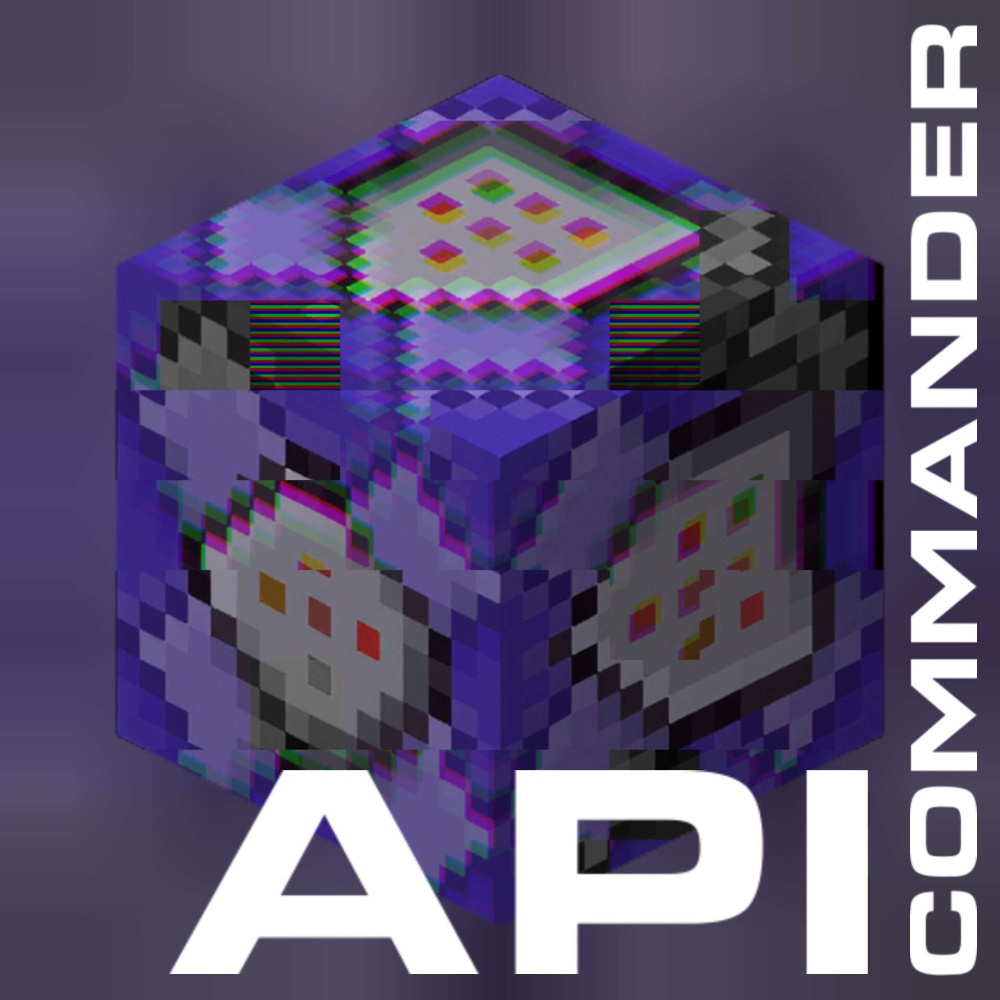

<div align="center">
    </a>

# Commander API

<a href="https://discord.gg/uTqyqtHWG4" target="_blank"></a>

### [ドキュメントを読む](https://capi.un-known.xyz/docs)
</div>

## Commander APIとは？
**Commander API**はMinecraft: Bedrock Edition向けのコマンド拡張アドオンです。  
**Commander API**はコマンドをより便利に使ってもらうため開発されました。  
このアドオンでは **Script API** を利用しているため、他のアドオンとの競合が発生しません。   

## インストール
**Commander API**は最新バージョンのMinecraft: Bedrock Editionをサポートしています。  
> レガシーバージョンについては[こちら](./LEGACY.md)
1. [Releases](https://github.com/Unknown-Creators-Team/Commander-API/releases/latest)より、最新バージョンのCommander APIをダウンロードします。
2. ダウンロードしたmcpackを実行しMinecraftにインポートさせます。
3. Commander APIを利用したいワールドのビヘイビアパックにCommander APIを追加します。

## 使い方
このアドオンでは主に `scriptevent` と `tag` を利用します。  
プレイヤーが `ブロックを設置した` などの **イベント** が発生した際にはそのプレイヤーに対して `tag` が付与されます。  

### scriptevent
一例として、爆発を生み出すコマンドとその動画を見てみましょう。
```mcfunction
/scriptevent capi:explosion {location=[~,~,~-10], radius=5}
```
<video src="https://capi.un-known.xyz/img/showcase/scriptevent/explosion.mp4" width="320" height="240" controls></video>

### イベント
プレイヤーが **ブロックを破壊したとき** にアクションバーへ破壊したブロックIDを表示するコマンドと、その動画を見てみましょう。
```mcfunction
execute as @a[tag=capi:break] at @s run scriptevent capi:actionbar <!tag=break>
```
<video src="https://capi.un-known.xyz/img/showcase/event/break_block.mp4" width="320" height="240" controls></video>

ほんのちょびっと、**Commander API**の機能を紹介してみました。  
[公式サイト](https://capi.un-known.xyz/)では更に多くの内容・ドキュメントがあるので、ぜひ覗いてみてください！

## Commander APIに貢献する
[こちら](./CONTRIBUTING.md)をお読みください。  
また、[Commander API Community](https://discord.gg/uTqyqtHWG4)への参加も推奨しています。

## ライセンス
**Commander API**は**GPLv3**の下で公開されています。  
詳細は[LICENSE](./LICENSE.md)をご覧ください。